# Логика питомца TamaFi

Описание состояний, поведения и алгоритмов виртуального питомца.

---

## 1. Обзор состояний

Питомец описывается несколькими независимыми измерениями:

| Измерение | Значения | Описание |
|-----------|----------|----------|
| **Stage** (стадия) | BABY → TEEN → ADULT → ELDER | Эволюция по возрасту |
| **Mood** (настроение) | 7 вариантов | Зависит от статов и WiFi |
| **Activity** (активность) | NONE, HUNT, DISCOVER, REST | Текущее занятие |
| **RestPhase** | NONE, ENTER, DEEP, WAKE | Подсостояние отдыха |

---

## 2. petTick и время

**petTick** — главная функция логики питомца. Вызывается из `loop()` примерно раз в 100 мс и обновляет всё состояние питомца.

```cpp
// TamaFi.ino, loop()
if (now - lastLogicTick >= 100) {
    lastLogicTick = now;
    if (currentScreen != SCREEN_BOOT && currentScreen != SCREEN_HATCH) {
        bool allowAutonomous = (currentScreen == SCREEN_HOME);
        petTick(petState, now, allowAutonomous);
    }
}
```

На экранах BOOT и HATCH petTick не вызывается. Автономные решения (`decideNextActivity`) разрешены только на SCREEN_HOME.

### 2.1. Источник времени

Используется **`millis()`** — миллисекунды с момента старта ESP32. В petTick передаётся `now = millis()`.

### 2.2. Таймеры в PetState

В PetState хранятся таймеры последнего срабатывания:

| Таймер | Переменная | Интервал | Действие при срабатывании |
|--------|------------|----------|---------------------------|
| Голод | hungerTimer | 5 с | hunger −2% |
| Счастье | happinessTimer | 7 с | happiness −1% или −3% |
| Здоровье | healthTimer | 10 с | health −1% или −2% |
| Возраст | ageTimer | 60 с | ageMinutes +1, затем часы/дни |

### 2.3. Логика срабатывания

```
если (now - hungerTimer >= 5000):
    hunger -= 2
    hungerTimer = now
```

Таймеры не «тикают» дискретно — проверяется, прошёл ли интервал с последнего обновления.

### 2.4. Возраст питомца

- **AGE_TICK_MS** = 60 000 (1 минута)
- 1 минута реального времени ≈ 1 минута возраста питомца
- Цепочка: минуты → часы (60 мин) → дни (24 ч)

### 2.5. Когда время не течёт

В **Deep Sleep** `loop()` не выполняется → petTick не вызывается → статы и возраст не меняются. При пробуждении состояние восстанавливается из `loadState()`.

### 2.6. Схема потока времени

```
millis() ──► now
    │
    ├──► petTick вызывается каждые 100 мс
    │
    └──► Внутри petTick:
         hungerTimer   ── каждые 5 с   ──► hunger −2
         happinessTimer ─ каждые 7 с  ──► happiness −1/−3
         healthTimer   ── каждые 10 с ──► health −1/−2
         ageTimer      ── каждые 60 с ──► ageMinutes +1
```

---

## 3. Основные статы питомца

```
┌─────────────────────────────────────────────────────────────┐
│                      PET (ядро данных)                       │
├─────────────┬─────────────┬─────────────┬───────────────────┤
│   hunger    │  happiness  │   health    │  age (min/h/days)  │
│   0–100%    │    0–100%   │   0–100%    │  минуты/часы/дни   │
└─────────────┴─────────────┴─────────────┴───────────────────┘
```

### 3.1. Деградация статов (таймеры)

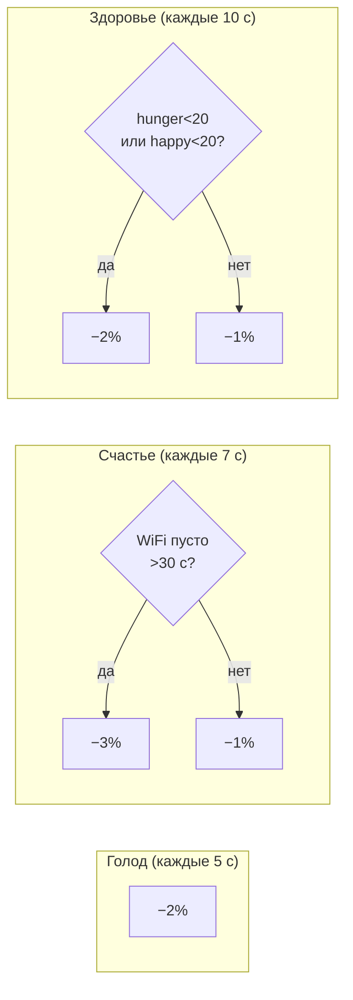

### 3.2. Возраст

- **AGE_TICK_MS** = 60 000 (1 минута реального времени = 1 минута возраста)
- Цепочка: минуты → часы → дни

---

## 4. Эволюция (Stage)

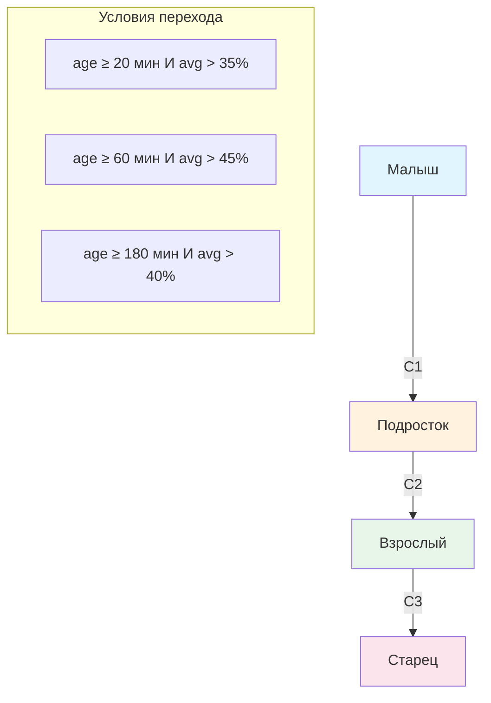

**avg** = (hunger + happiness + health) / 3

---

## 5. Настроение (Mood)

Настроение вычисляется **каждый тик** в строгом порядке приоритета:

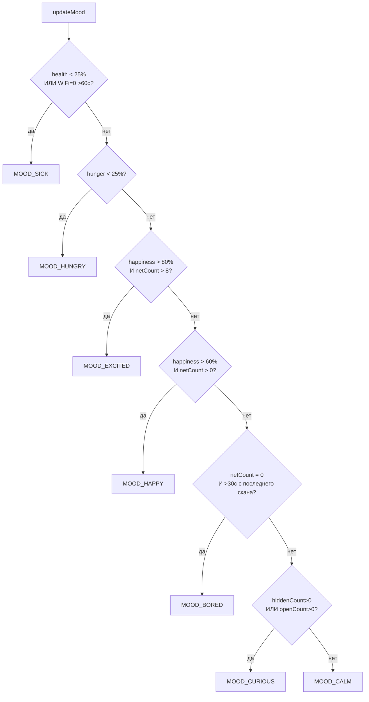

| Mood | Русское | Условие |
|------|---------|---------|
| MOOD_SICK | Болен | health < 25 или (WiFi=0 и >60с) |
| MOOD_HUNGRY | Голодный | hunger < 25 |
| MOOD_EXCITED | Возбуждён | happiness > 80 и netCount > 8 |
| MOOD_HAPPY | Счастлив | happiness > 60 и netCount > 0 |
| MOOD_BORED | Скучает | netCount = 0 и >30с без скана |
| MOOD_CURIOUS | Любопытный | hiddenCount>0 или openCount>0 |
| MOOD_CALM | Спокоен | по умолчанию |

---

## 6. Активности (Activity)

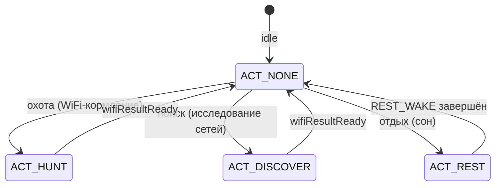

### 6.1. Охота (ACT_HUNT)

- **Цель:** накормить питомца данными WiFi
- **Триггер:** автономное решение или команда PET_CMD_FEED
- **Результат:** `resolveHunt()` по `lastWifi`

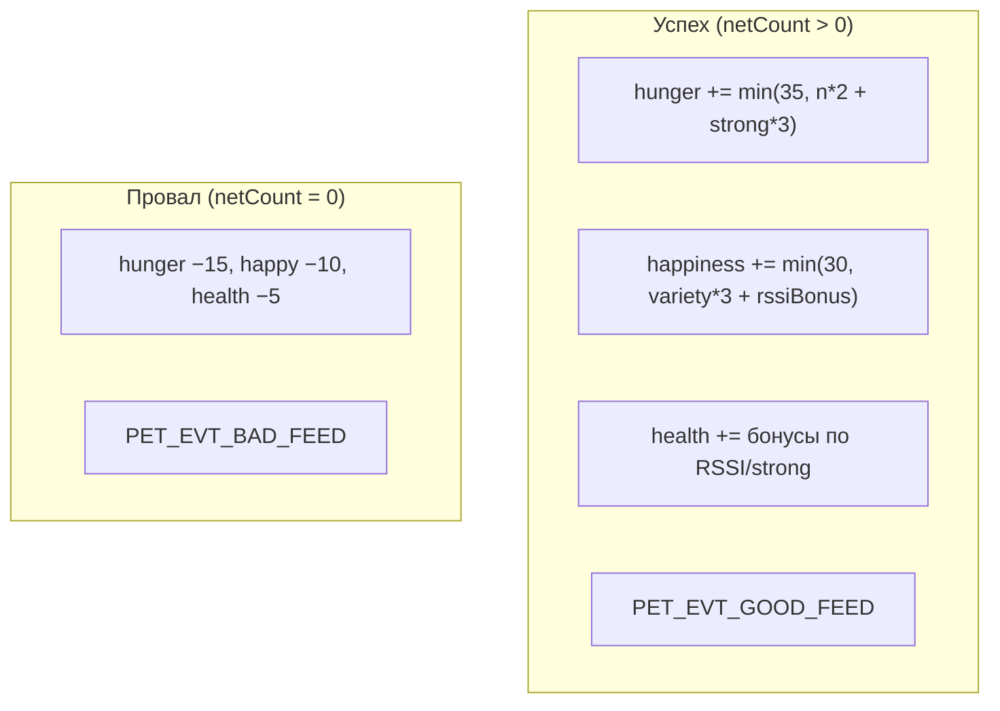

### 6.2. Поиск (ACT_DISCOVER)

- **Цель:** исследовать WiFi (любопытство)
- **Результат:** `resolveDiscover()` — счастье, небольшой расход голода

| netCount | happiness | hunger |
|----------|-----------|--------|
| 0 | −5 | −3 |
| >0 | +curiosity/2 (max 35) | −5 |

### 6.3. Отдых (ACT_REST) — конечный автомат

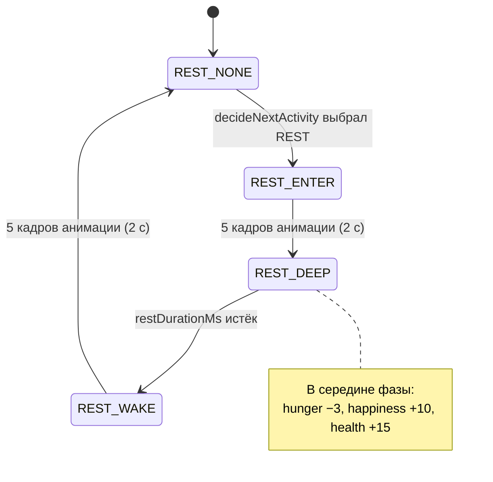

**Параметры отдыха:**
- REST_ENTER_DELAY_MS = 400
- REST_WAKE_DELAY_MS = 400
- REST_MIN_MS = 5000, REST_MAX_MS = 15000 (случайная длительность)

---

## 7. Автономное принятие решений

Питомец сам выбирает активность, когда `activity == ACT_NONE` и `restPhase == REST_NONE`.

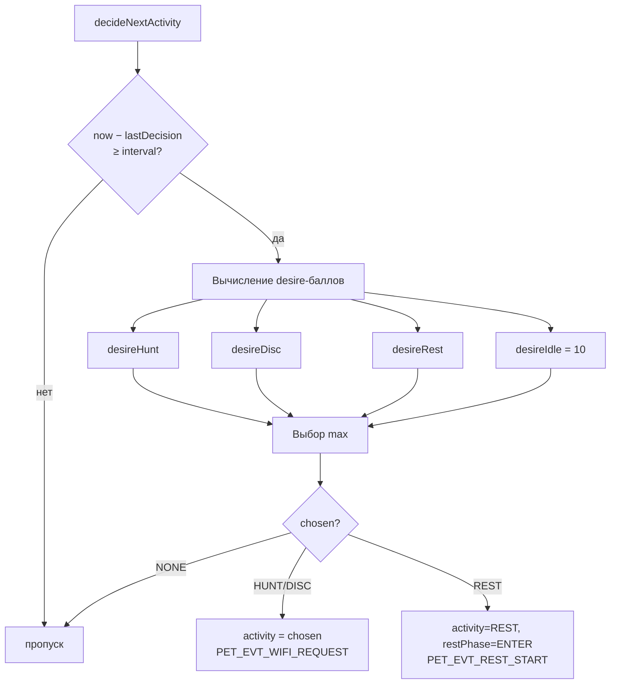

### 7.1. Формулы desire

| Активность | Формула |
|------------|---------|
| **desireHunt** | (100−hunger) + traitCuriosity/2; ÷2 если netCount=0 |
| **desireDisc** | traitCuriosity + hidden×10 + open×6 + net×2 + rand(0,20); ÷2 если netCount=0 |
| **desireRest** | (100−health) + traitStress/2; −10 если hunger<20 |
| **desireIdle** | 10 (базовый) |

### 7.2. Модификаторы по настроению

| Mood | Hunt | Disc | Rest |
|------|------|------|------|
| MOOD_HUNGRY | +20 | — | −10 |
| MOOD_CURIOUS | — | +15 | — |
| MOOD_SICK | — | −10 | +20 |
| MOOD_EXCITED | +5 | +10 | — |
| MOOD_BORED | +5 | +10 | — |

**Интервал решений:** random(8000, 15000) мс.

---

## 8. Команды (UI → Pet)

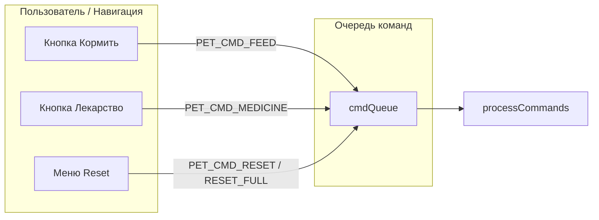

| Команда | Действие |
|---------|----------|
| PET_CMD_FEED | ACT_HUNT + PET_EVT_WIFI_REQUEST (кулдаун 30 с) |
| PET_CMD_MEDICINE | health +5 (кулдаун 30 с) |
| PET_CMD_RESET | hunger/happiness/health=70, сброс таймеров |
| PET_CMD_RESET_FULL | + сброс возраста, stage=BABY, новые traits |

---

## 9. События (Pet → Оркестратор)

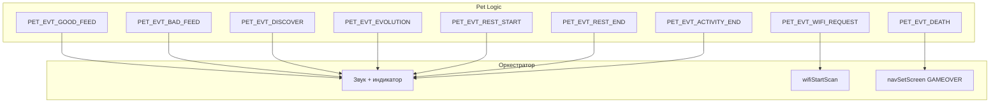

---

## 10. Главный цикл petTick

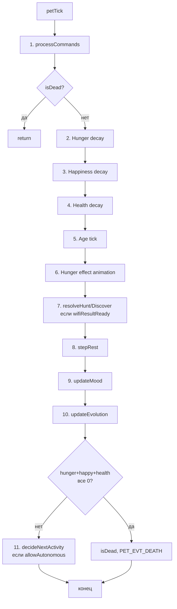

---

## 11. Черты личности (Traits)

Используются только в `decideNextActivity`:

| Trait | Диапазон | Влияние |
|-------|----------|---------|
| traitCuriosity | 40–90 | desireHunt, desireDisc |
| traitActivity | 30–90 | (резерв) |
| traitStress | 20–80 | desireRest |

---

## 12. Смерть

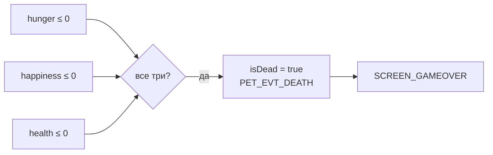

---

## 13. Константы времени

| Константа | Значение |
|-----------|----------|
| HUNGER_TICK_MS | 5000 |
| HAPPINESS_TICK_MS | 7000 |
| HEALTH_TICK_MS | 10000 |
| AGE_TICK_MS | 60000 |
| DECISION_INTERVAL | 8000–15000 (random) |
| REST_MIN_MS / REST_MAX_MS | 5000 / 15000 |
| FEED_COOLDOWN_MS | 30000 |
| MEDICINE_COOLDOWN_MS | 30000 |

---

## 14. Варианты шкалы времени питомца

Справочник по подходам к времени в виртуальных питомцах (по TAMAGOTCHI_P1_P2_MECHANICS.md и др.).

### 14.1. Tamagotchi P1/P2 — две системы времени

| Система | Как считается | Пример |
|---------|---------------|--------|
| **Возраст (годы)** | Растёт при каждом пробуждении ото сна | 1 год ≈ 1 реальный день |
| **Ранние стадии** | Реальное время в минутах | Яйцо: 5 мин, Babytchi: 65 мин |

**Эволюция в реальном времени:**
- Яйцо → Babytchi: 5 минут
- Babytchi → Marutchi: 65 минут
- Marutchi → Teen: к 3 годам ≈ 3 дня
- Teen → Adult: к 6 годам ≈ 6 дней
- Care mistake: ~15 минут без реакции

**Особенность:** всё привязано к реальным часам устройства; сон по расписанию (20:00–9:00 и т.п.).

### 14.2. Варианты шкал

| Вариант | Реальное | Питомец | Примеры |
|---------|---------|---------|---------|
| **A. Реальное время (1:1)** | 1 мин | 1 мин | Tamagotchi, ChickenPet, Lentopet |
| **B. Ускоренное (N:1)** | 1 сек | 1 мин | Демо, тесты |
| **B. Ускоренное** | 1 мин | 10 мин | Компромисс |
| **B. Ускоренное** | 45 сек | 1 час | Coral Island |
| **C. Событийное** | — | по пробуждениям | Tamagotchi (возраст в годах) |
| **D. Гибрид** | ранние стадии в мин, возраст по событиям | — | Tamagotchi P1 |

### 14.3. Сравнение для TamaFi

| Вариант | AGE_TICK_MS | До ELDER | Стиль |
|---------|-------------|----------|-------|
| Реальное (сейчас) | 60 000 | ~3 часа | Tamagotchi-подобный |
| 1 сек = 1 мин | 1 000 | ~3 мин | Быстрый демо |
| 1 мин = 10 мин | 6 000 | ~18 мин | Компромисс |

### 14.4. Рекомендации

- **Продакшен / долгая игра:** 1:1 или близко к Tamagotchi (1 год ≈ 1 день).
- **Демо / тесты:** 1 сек = 1 мин (AGE_TICK_MS = 1000).
- **Баланс:** 1 мин = 10 мин питомца (AGE_TICK_MS = 6000).
